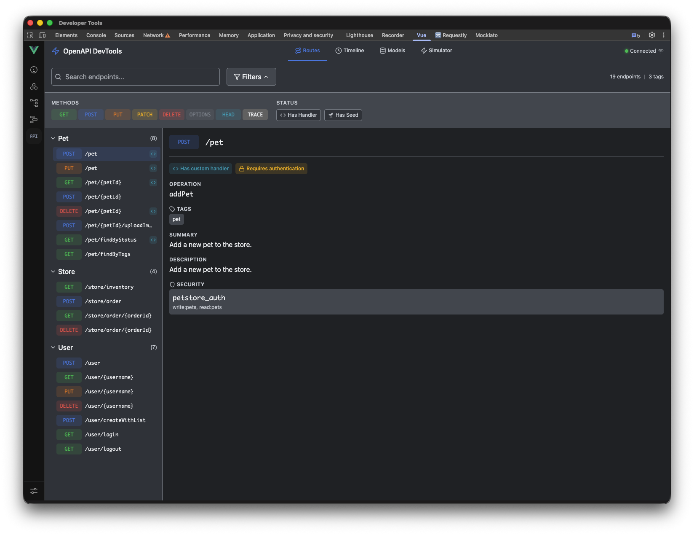
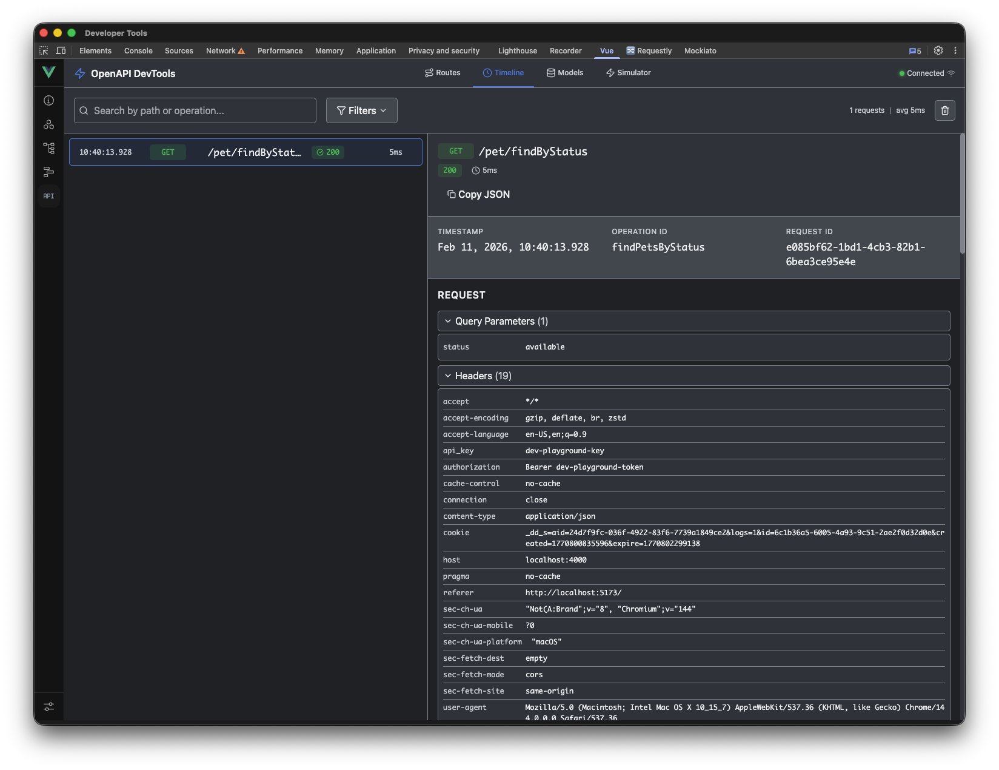
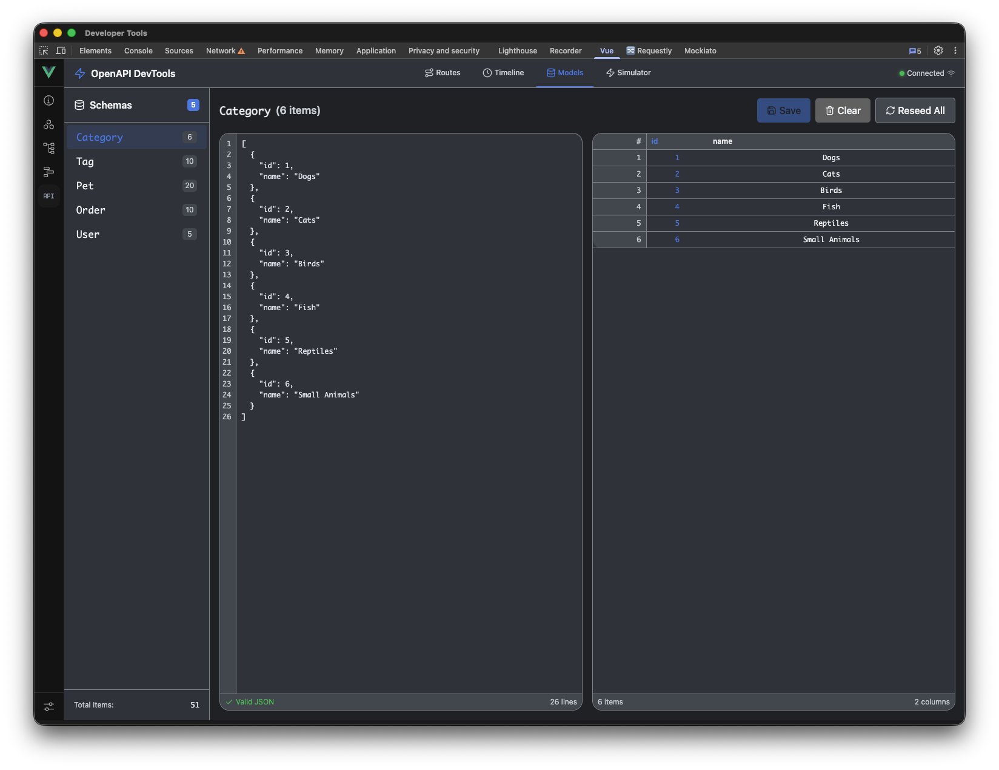
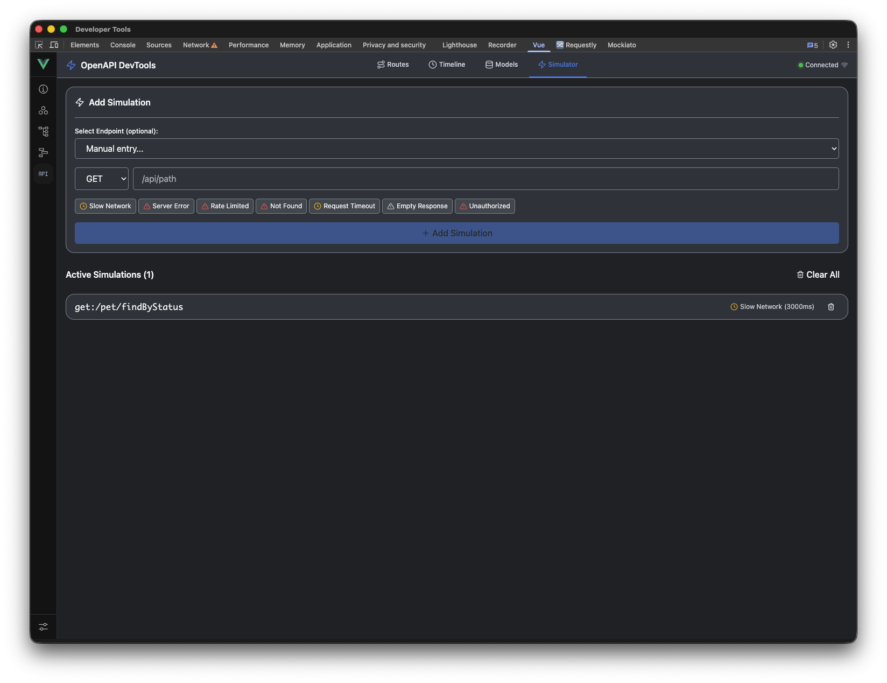
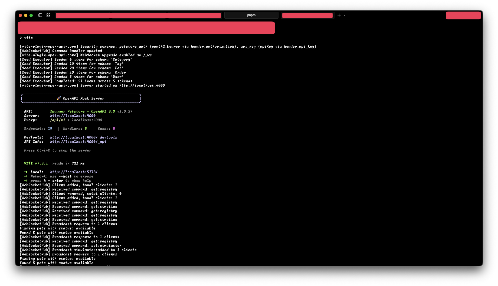

# vite-plugin-open-api-server

[](https://www.npmjs.com/package/@websublime/vite-plugin-open-api-server)
[](./LICENSE)
[](https://nodejs.org/)

Vite plugin that provides a local OpenAPI server for frontend development. Enables frontend developers to work independently of backend services, with realistic data generation, custom handlers, and integrated DevTools.

## Features

- **OpenAPI-First** - Automatic endpoint generation from OpenAPI 2.0/3.x specifications
- **Custom Hono Server** - Lightweight, fast HTTP server with native WebSocket support
- **Realistic Data** - Automatic fake data generation based on schemas using Faker.js
- **Custom Handlers** - Override responses with custom logic per endpoint
- **Seed Data** - Populate the store with consistent test data
- **In-Memory Store** - Full CRUD operations per schema with configurable ID fields
- **Hot Reload** - Automatically reload handlers and seeds on file changes
- **Vue DevTools** - Integrated SPA with Routes, Timeline, Models, and Simulator views
- **Error Simulation** - Simulate network delays, errors, and edge cases
- **TypeScript** - Full TypeScript support with exported types

## Quick Start

### Installation

```bash
pnpm add -D @websublime/vite-plugin-open-api-server
```

### Basic Usage

Add the plugin to your `vite.config.ts`:

```typescript
import { defineConfig } from 'vite';
import vue from '@vitejs/plugin-vue';
import { openApiServer } from '@websublime/vite-plugin-open-api-server';

export default defineConfig({
  plugins: [
    vue(),
    openApiServer({
      spec: './openapi/petstore.yaml',
      port: 4000,
      proxyPath: '/api/v3',
    }),
  ],
});
```

The plugin will:

1. Parse and process your OpenAPI specification (bundle, upgrade to 3.1, dereference)
2. Start a Hono server with auto-generated routes
3. Proxy requests from `/api/v3/*` to the server
4. Generate realistic responses based on your schemas
5. Register a custom tab in Vue DevTools

## Configuration Options

```typescript
openApiServer({
  // Required
  spec: './openapi/petstore.yaml',  // Path to OpenAPI spec (YAML/JSON) or URL

  // Server
  port: 4000,                        // Server port (default: 4000)
  proxyPath: '/api/v3',              // Vite proxy path (default: '/api')

  // Customization
  handlersDir: './mocks/handlers',   // Custom handlers directory
  seedsDir: './mocks/seeds',         // Seed data directory
  idFields: {                        // ID field per schema
    User: 'username',
    Order: 'orderId',
  },

  // Features
  enabled: true,                     // Enable/disable plugin
  devtools: true,                    // Enable Vue DevTools integration
  timelineLimit: 500,                // Max timeline events

  // CORS
  cors: true,                        // Enable CORS middleware (default: true)
  corsOrigin: '*',                   // CORS allowed origin(s) (default: '*')

  // Logging
  silent: false,                     // Suppress startup banner (default: false)
  logger: customLogger,              // Custom logger (default: Vite logger)
});
```

### Options Reference

| Option | Type | Default | Description |
|--------|------|---------|-------------|
| `spec` | `string` | *(required)* | Path to OpenAPI spec file (YAML/JSON) or URL |
| `port` | `number` | `4000` | Mock server port |
| `proxyPath` | `string` | `'/api'` | Vite proxy path prefix |
| `handlersDir` | `string` | `'./mocks/handlers'` | Custom handlers directory |
| `seedsDir` | `string` | `'./mocks/seeds'` | Seed data directory |
| `idFields` | `Record<string, string>` | `{}` | ID field per schema (default field: `'id'`) |
| `enabled` | `boolean` | `true` | Enable/disable the plugin |
| `devtools` | `boolean` | `true` | Enable Vue DevTools integration |
| `timelineLimit` | `number` | `500` | Max timeline events in memory |
| `cors` | `boolean` | `true` | Enable CORS middleware |
| `corsOrigin` | `string \| string[]` | `'*'` | CORS allowed origin(s) |
| `silent` | `boolean` | `false` | Suppress startup banner |
| `logger` | `Logger` | Vite logger | Custom logger instance |

## Custom Handlers

Create handlers to override default responses for specific operations:

```typescript
// mocks/handlers/pets.handlers.ts
import { defineHandlers } from '@websublime/vite-plugin-open-api-server';

export default defineHandlers({
  getPetById: ({ req, store, logger }) => {
    const petId = Number.parseInt(req.params.petId, 10);
    const pet = store.get('Pet', petId);

    if (!pet) {
      logger.warn(`Pet ${petId} not found`);
      return { type: 'status', status: 404, data: { message: 'Pet not found' } };
    }
    return { type: 'raw', data: pet };
  },

  findPetsByStatus: ({ req, store }) => {
    const status = (req.query.status as string)?.toLowerCase() || 'available';
    const filtered = store.list('Pet').filter((p: any) => p.status?.toLowerCase() === status);
    return { type: 'raw', data: filtered };
  },

  addPet: ({ req, store, faker }) => {
    const newPet = store.create('Pet', {
      ...(req.body as object),
      id: faker.number.int({ min: 1000, max: 9999 }),
    });
    return { type: 'status', status: 201, data: newPet };
  },
});
```

### Handler Context

Handlers receive a context object with:

| Property | Type | Description |
|----------|------|-------------|
| `req.method` | `string` | HTTP method (uppercase: `GET`, `POST`, etc.) |
| `req.path` | `string` | Request path |
| `req.params` | `Record<string, string>` | Path parameters (e.g., `{ petId: '123' }`) |
| `req.query` | `Record<string, string \| string[]>` | Query parameters |
| `req.body` | `unknown` | Parsed JSON request body |
| `req.headers` | `Record<string, string>` | Request headers |
| `store` | `Store` | In-memory data store (see [Store API](#store-api)) |
| `faker` | `Faker` | Faker.js instance for data generation |
| `logger` | `Logger` | Logger with `log`, `info`, `warn`, `error`, `debug` methods |
| `security` | `SecurityContext` | Security context (see [Security Handling](#security-handling)) |

### Handler Return Types

Handlers must return a discriminated union with a `type` field:

| Return Type | Fields | Description |
|-------------|--------|-------------|
| `{ type: 'raw', data }` | `data: unknown` | Returns data with HTTP 200 |
| `{ type: 'status', status, data }` | `status: number`, `data: unknown` | Returns data with custom status code |
| `{ type: 'full', status, data, headers }` | `status: number`, `data: unknown`, `headers: Record<string, string>` | Custom status + custom response headers |

```typescript
export default defineHandlers({
  // Raw: implicit 200 OK
  listPets: ({ store }) => {
    return { type: 'raw', data: store.list('Pet') };
  },

  // Status: custom HTTP status code
  createPet: ({ req, store, faker }) => {
    const pet = store.create('Pet', {
      ...(req.body as object),
      id: faker.number.int({ min: 1000, max: 9999 }),
    });
    return { type: 'status', status: 201, data: pet };
  },

  // Full: custom status + custom headers
  updatePet: ({ req, store }) => {
    const petId = Number.parseInt(req.params.petId, 10);
    const updated = store.update('Pet', petId, req.body as Record<string, unknown>);
    return {
      type: 'full',
      status: 200,
      data: updated,
      headers: { 'X-Updated-At': new Date().toISOString() },
    };
  },
});
```

### Handler File Convention

- **Pattern**: `*.handlers.{ts,js,mjs}`
- **Location**: `handlersDir` directory (default: `./mocks/handlers`), scanned recursively
- **Keys**: Each key in the `defineHandlers()` object must match an `operationId` from your OpenAPI spec
- **Async**: Handlers can be `async` functions
- **Duplicates**: If multiple files define the same `operationId`, the last loaded file wins (warning logged)

## Seed Data

Populate the store with initial data:

```typescript
// mocks/seeds/pets.seeds.ts
import { defineSeeds } from '@websublime/vite-plugin-open-api-server';

export default defineSeeds({
  Pet: ({ seed, faker }) => seed.count(15, (index) => ({
    id: index + 1,
    name: faker.animal.dog(),
    category: {
      id: faker.number.int({ min: 1, max: 5 }),
      name: faker.helpers.arrayElement(['Dogs', 'Cats', 'Birds']),
    },
    photoUrls: [faker.image.url()],
    status: faker.helpers.arrayElement(['available', 'pending', 'sold']),
  })),

  Category: ({ seed }) => seed([
    { id: 1, name: 'Dogs' },
    { id: 2, name: 'Cats' },
    { id: 3, name: 'Birds' },
  ]),
});
```

### Seed Context

Seeds receive a context object with:

| Property | Type | Description |
|----------|------|-------------|
| `seed` | `SeedHelper` | Callable helper (see below) |
| `store` | `Store` | Access already-seeded data (for cross-schema relationships) |
| `faker` | `Faker` | Faker.js instance for realistic data generation |
| `schema` | `SchemaObject` | OpenAPI schema definition for the current type |
| `logger` | `Logger` | Logger for debugging seed execution |

### Seeding Methods

**`seed(array)`** — Seed with a static array of items:

```typescript
Category: ({ seed }) => seed([
  { id: 1, name: 'Dogs' },
  { id: 2, name: 'Cats' },
]),
```

**`seed.count(n, factory)`** — Generate N items with a factory function (receives zero-based `index`):

```typescript
Pet: ({ seed, faker }) => seed.count(20, (index) => ({
  id: index + 1,
  name: faker.animal.dog(),
  status: faker.helpers.arrayElement(['available', 'pending', 'sold']),
})),
```

**`seed(factory)`** — Generate a single item from a factory function:

```typescript
Config: ({ seed }) => seed(() => ({
  maintenance: false,
  version: '1.0.0',
})),
```

### Cross-Schema References

Seeds are executed in definition order. Later schemas can reference earlier ones via `store`:

```typescript
export default defineSeeds({
  // Seeded first
  Pet: ({ seed, faker }) => seed.count(20, (index) => ({
    id: index + 1,
    name: faker.animal.dog(),
    status: faker.helpers.arrayElement(['available', 'pending', 'sold']),
  })),

  // Seeded second — can access Pet data
  Order: ({ seed, store, faker }) => seed.count(10, () => {
    const pets = store.list('Pet');
    const randomPet = faker.helpers.arrayElement(pets) as { id: number };
    return {
      id: faker.number.int({ min: 1, max: 10000 }),
      petId: randomPet?.id,
      status: faker.helpers.arrayElement(['placed', 'approved', 'delivered']),
    };
  }),
});
```

### Seed File Convention

- **Pattern**: `*.seeds.{ts,js,mjs}`
- **Location**: `seedsDir` directory (default: `./mocks/seeds`), scanned recursively
- **Execution order**: Schemas within a file execute in definition order; multiple files are processed in glob discovery order
- **Duplicates**: If multiple files define the same schema name, the last loaded file wins (warning logged)

## Store API

The in-memory store provides CRUD operations with O(1) lookups by schema and ID:

```typescript
// Basic CRUD
store.list('Pet');                              // Get all items (returns unknown[])
store.get('Pet', 123);                          // Get by ID (returns unknown | null)
store.create('Pet', { id: 1, name: 'Buddy' }); // Create item (returns created item)
store.update('Pet', 123, { status: 'sold' });   // Merge updates (returns updated | null)
store.delete('Pet', 123);                       // Delete by ID (returns boolean)

// Clear operations
store.clear('Pet');                             // Remove all items for a schema
store.clearAll();                               // Remove all data across all schemas

// ID field configuration
store.setIdField('User', 'username');           // Set ID field (before creating records)
store.getIdField('Pet');                        // Get configured ID field (default: 'id')

// Introspection
store.getSchemas();                             // Get all schema names with data
store.getCount('Pet');                          // Get item count for a schema
store.hasSchema('Pet');                         // Check if schema has data
store.has('Pet', 123);                          // Check if specific item exists
```

Items are stored as shallow copies. The `idFields` plugin option pre-configures ID fields at startup, but you can also call `store.setIdField()` before creating records for a schema.

## Vue DevTools Integration

The plugin integrates with Vue DevTools via a custom tab, and also provides a standalone DevTools SPA.

### Accessing DevTools

- **Vue DevTools tab** — Automatically registered when `devtools: true` (default). Appears as an "OpenAPI Server" tab in Vue DevTools.
- **Standalone** — Navigate to `http://localhost:<port>/_devtools/` directly in any browser.
- **Via Vite proxy** — Also accessible at `http://localhost:<vitePort>/_devtools/` through the Vite dev server.

### Screenshots

<p align="center">
  
  
  
  
  
</p>

### Pages

| Page | Description |
|------|-------------|
| **Routes** | All API endpoints grouped by tags. Shows method, path, operationId, and which endpoints have custom handlers or seed data. |
| **Timeline** | Real-time request/response log with method, path, status code, duration, and simulated flag. Supports detail inspection and clearing. |
| **Models** | JSON editor for inspecting and modifying store data per schema. View item counts, add/modify items, or bulk replace via JSON. |
| **Simulator** | Configure simulations for specific endpoints — set custom status codes, delays, and response bodies. Includes preset simulations. |
| **Console** | Interactive request/response console for sending test requests, viewing raw responses, and replaying saved requests. |

### Simulation Presets

| Preset | Effect |
|--------|--------|
| Slow Network (3G) | 3000ms delay |
| Server Error (500) | HTTP 500 response |
| Rate Limit (429) | HTTP 429 response |
| Not Found (404) | HTTP 404 response |
| Request Timeout | 30000ms delay |
| Empty Response | HTTP 200 with empty body |
| Unauthorized (401) | HTTP 401 response |

### WebSocket

- **Connection URL**: `ws://localhost:<port>/_ws`
- **Purpose**: Real-time updates for timeline events, store changes, and simulation state
- **Dependency**: Requires `@hono/node-ws` as an optional peer dependency
- **Fallback**: The DevTools SPA falls back to HTTP polling if WebSocket is unavailable

## Security Handling

The plugin automatically enforces OpenAPI security schemes defined in your spec. This is a **mock/stub** implementation designed for local development — it validates that credentials are **present** but accepts any non-empty value.

### Supported Schemes

| Scheme | Location | Validation |
|--------|----------|-----------|
| HTTP Bearer | `Authorization: Bearer <token>` | Non-empty token |
| HTTP Basic | `Authorization: Basic <base64>` | Non-empty string |
| API Key (header) | Custom header (e.g., `X-API-Key`) | Non-empty value |
| API Key (query) | Query parameter | Non-empty value |
| API Key (cookie) | Cookie | Non-empty value |
| OAuth2 | `Authorization: Bearer <token>` | Non-empty token |

### Behavior

- **Public endpoints** (no `security` in spec) are unrestricted
- **Secured endpoints** return `401 Unauthorized` when credentials are missing
- **Any non-empty value** is accepted — no real token/key validation
- **OR logic** between multiple security requirements (e.g., `[{bearerAuth: []}, {apiKey: []}]` — either one satisfies the requirement)
- `WWW-Authenticate` header is included in 401 responses

> **Note — simplified semantics:** The OpenAPI spec supports AND logic within a
> single security requirement object (e.g., `{ bearerAuth: [], apiKey: [] }` means
> *both* are required). This plugin flattens compound requirements into individual
> entries and applies OR logic across all of them, so a compound AND requirement
> is treated as either/or. This covers the vast majority of real-world specs where
> each requirement lists a single scheme. Supporting grouped AND-within-OR semantics
> is potential future work.

### Security Context in Handlers

Custom handlers receive a `security` property in the context:

```typescript
export default defineHandlers({
  getSecuredResource: ({ security, store }) => {
    // security.authenticated — boolean, whether the endpoint requires auth
    // security.scheme       — name of the satisfied scheme (e.g., 'bearerAuth')
    // security.credentials  — raw credential value from the request
    // security.scopes       — required scopes from the OpenAPI spec

    console.log(`Authenticated via: ${security.scheme}`);
    return { type: 'raw', data: store.list('Resource') };
  },
});
```

### Frontend Integration

When your OpenAPI spec defines security, your frontend code must send the appropriate headers:

```typescript
// For Bearer/OAuth2 endpoints
fetch('/api/v3/pets', {
  headers: { Authorization: 'Bearer my-dev-token' },
});

// For API Key (header) endpoints
fetch('/api/v3/store/inventory', {
  headers: { 'api_key': 'any-value' },
});
```

## Response Priority

Responses are determined in this order:

0. **Security Validation** - Returns 401 if credentials are missing for secured endpoints
1. **Active Simulation** - If a simulation is active for the endpoint (body override or error status)
2. **Custom Handler** - If a handler is defined for the operationId
3. **Seed Data** - If seed data exists for the response schema
4. **Spec Example** - If an example is defined in the OpenAPI spec
5. **Auto-Generated** - Generated using Faker.js based on schema properties

Simulation delays are applied regardless of whether the simulation overrides the response body.

## Hot Reload

The plugin watches handler and seed files for changes and automatically reloads them without restarting Vite.

### What Reloads

- **Handler files** (`*.handlers.{ts,js,mjs}`) — Reloaded on add, change, or delete. The handler map is replaced in-place so existing routes see the new logic immediately.
- **Seed files** (`*.seeds.{ts,js,mjs}`) — Reloaded on add, change, or delete. **Note:** Seed reload clears **all** data in the store and re-executes all seed files.

### What Does NOT Reload

- **OpenAPI spec** — Changing the spec file requires a full Vite restart.
- **Plugin configuration** — Changes to `vite.config.ts` require a restart.

### Behavior Details

- Changes are debounced with a **100ms delay** to prevent rapid-fire reloads during bulk saves.
- File writes are checked for stability (100ms threshold) to ensure files are fully written before reload.
- Reload notifications appear in the console unless `silent: true`.

## Internal API

The server exposes internal HTTP endpoints at `/_api/*` for programmatic access and DevTools communication. These are proxied through Vite at `http://localhost:<vitePort>/_api/*`.

| Method | Endpoint | Description |
|--------|----------|-------------|
| GET | `/_api/health` | Health check (status, version, endpoint/schema/simulation counts) |
| GET | `/_api/document` | Processed OpenAPI document (JSON) |
| GET | `/_api/registry` | Endpoint registry (all routes with metadata) |
| GET | `/_api/store` | List all schemas with item counts |
| GET | `/_api/store/:schema` | Get all items for a schema |
| POST | `/_api/store/:schema` | Bulk replace items (JSON array body) |
| DELETE | `/_api/store/:schema` | Clear all items for a schema |
| GET | `/_api/timeline` | Request/response timeline (supports `?limit=N`) |
| DELETE | `/_api/timeline` | Clear timeline |
| GET | `/_api/simulations` | List active simulations |
| POST | `/_api/simulations` | Add/update simulation (JSON body with `path`, `operationId`, `status`) |
| DELETE | `/_api/simulations/:path` | Remove simulation by encoded path |
| DELETE | `/_api/simulations` | Clear all simulations |

## Troubleshooting

### Port Already in Use

```text
Error: Port 4000 is already in use
```

Another process is using the configured port. Either stop that process or change the `port` option in your plugin config.

### Handler Not Being Called

- Verify the handler file matches the naming pattern: `*.handlers.{ts,js,mjs}`
- Verify the handler key matches the `operationId` from your OpenAPI spec exactly (case-sensitive)
- Check for duplicate `operationId` warnings in the console
- Ensure `handlersDir` points to the correct directory

### Seed Data Not Appearing

- Verify the seed file matches the naming pattern: `*.seeds.{ts,js,mjs}`
- Verify the schema name key matches a schema in your OpenAPI spec's `components.schemas`
- Ensure the seed function returns an array — for single items, use either `seed([item])` (explicit array) or `seed(() => item)` (factory form)
- If using cross-schema references, ensure referenced schemas are defined before the dependent one in the seed file

### Hot Reload Not Working

- Ensure handler/seed files use the correct naming pattern (plural: `.handlers.`, `.seeds.`)
- Check that `handlersDir`/`seedsDir` paths are correct relative to your project root
- Look for error messages in the console (reload failures are logged)

### 401 Unauthorized on All Requests

- Your OpenAPI spec has security requirements defined on the endpoint
- The plugin enforces that credentials are present (any non-empty value is accepted)
- Add the required header/query parameter to your frontend requests (see [Security Handling](#security-handling))

### DevTools Not Loading

- Ensure `devtools: true` (default) in plugin config
- For the Vue DevTools tab: requires `@vue/devtools-api` in your project
- For standalone access: navigate directly to `http://localhost:<port>/_devtools/`
- If a "serving placeholder" warning appears, run `pnpm build` to build the DevTools SPA

### WebSocket Connection Failed

- WebSocket support requires `@hono/node-ws` as an optional peer dependency
- Install it: `pnpm add -D @hono/node-ws`
- The DevTools SPA still works via HTTP polling if WebSocket is unavailable

### TypeScript Errors in Handler/Seed Files

- Import `defineHandlers` and `defineSeeds` from `@websublime/vite-plugin-open-api-server`
- Handler functions must return a discriminated union with `type: 'raw' | 'status' | 'full'`
- Seed functions must return `unknown[]` (use the `seed()` helper which handles this)

## Monorepo Structure

```
vite-open-api-server/
├── packages/
│   ├── core/                  # Core server logic (Hono, store, generator)
│   ├── devtools-client/       # Vue SPA for DevTools
│   ├── playground/            # Demo application (private)
│   └── server/                # Vite plugin wrapper (main package)
└── history/                   # Planning and architecture docs
```

| Package | Description |
|---------|-------------|
| `@websublime/vite-plugin-open-api-core` | Core server, store, router, generator |
| `@websublime/vite-plugin-open-api-devtools` | Vue DevTools SPA |
| `@websublime/vite-plugin-open-api-server` | Vite plugin (main package) |

## Development

### Prerequisites

- **Node.js**: ^20.19.0 || >=22.12.0
- **pnpm**: 9.x

### Getting Started

```bash
# Install dependencies
pnpm install

# Build all packages
pnpm build

# Run the playground
pnpm playground

# Run tests
pnpm test

# Lint and format
pnpm lint
pnpm format
```

### Available Scripts

| Command | Description |
|---------|-------------|
| `pnpm install` | Install all dependencies |
| `pnpm dev` | Start packages in watch mode |
| `pnpm build` | Build all packages |
| `pnpm test` | Run tests with Vitest |
| `pnpm lint` | Check code with Biome |
| `pnpm typecheck` | Run TypeScript type checking |
| `pnpm playground` | Start the playground application |

## Documentation

- [Product Requirements](./history/PRODUCT-REQUIREMENTS-DOC.md) - Product vision and features
- [Technical Specification](./history/TECHNICAL-SPECIFICATION.md) - Architecture and implementation details

## Contributing

Contributions are welcome! This project uses:

- **Beads** for issue tracking (`bd ready` to find work)
- **Biome** for linting and formatting
- **Conventional commits** for commit messages

## License

[MIT](./LICENSE) © WebSublime
